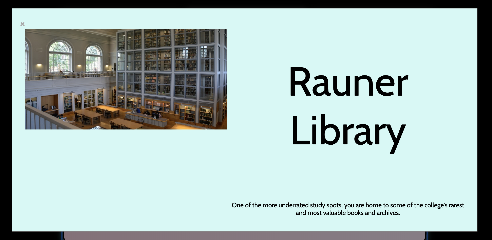

### Frances Cohen
### Lab 2: Buzzfeed Quiz
### CS 52 Spring 2019

## Description

For this project, I created a Buzzfeed-style quiz to determine what building on Dartmouth's campus you are! The quiz consists of 4 questions, with 6 choices each--the choices for the first and third question are images, and for the second and fouth they are clickable text boxes. I chose to focus on styling for my project, and included an animated loading effect for the header (slides in from above) a shake animation hover effect for all the choices (both images and text boxes), a gradient hover effect for the done button, and an animated entrance effect for the modal, which displays the answer to the quiz with both an image and some text. Finally, I included responsive design so the the elements rearrange/resize for mobile.

## Screen caps

### Header entrance effect (difficult to capture in screenshot)

### Shake hover effect on choices (and box shadow):

### Gradient hover effect on "Done" button:

### Animation on modal display (difficult to capture in screenshot)

### Responsive design for small screen

